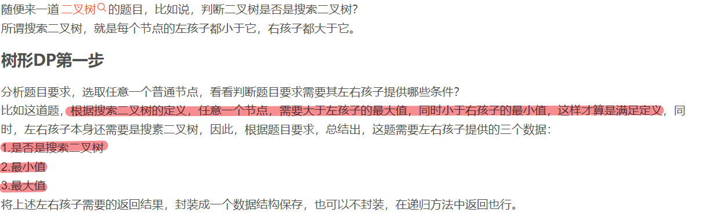
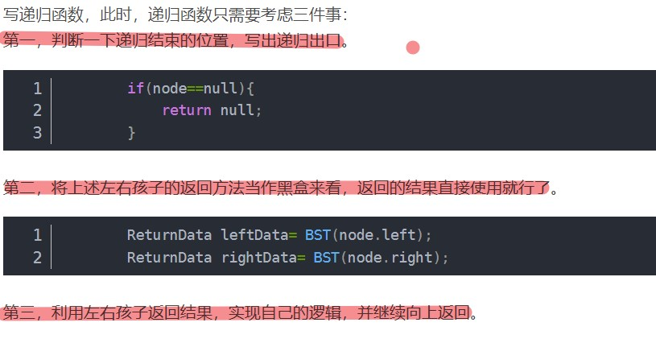

学习博客：https://blog.csdn.net/weixin_43923436/article/details/116701317

# 树的自底向上

求树形 DP 时，一般都是从根节点开始递归求，然后递归到 u 这个点时，先把 u 的两个儿子节点先处理好。==也就是说 树形 DP 是采用的树的自底向上的求法，任意一个节点，需要用到它的左右孩子的返回值，通常的递归出口为叶子节点以及非法的子树。==

**树形 DP 的分析步骤：**

**1）分析题目要求，选取任意一个普通节点，看看判断题目要求其左右孩子需要提供哪些条件。**

> 将左右孩子需要提供的数据封装成一个数据结构保存，也可以不封装，在递归方法中返回也行。

**2）编写递归函数，考虑以下三点：**

> 1）判断一下递归函数的出口（一般来说叶子节点/空节点作为递归出口）；
>
> 2）将上述左右孩子的返回方法当作黑盒来看，返回的结果直接使用就可以了；
>
> 3）利用左右孩子的返回结果来实现自己的逻辑，并继续向上返回；

# 树的自顶向下

**自顶向下的分析步骤：**

**1）分析题目要求，选取任意一个普通节点，需要设计一些参数，利用这些参数和本节点的值来传递给它的儿子节点的参数。**

**2）编写递归出口，进行递归即可。**